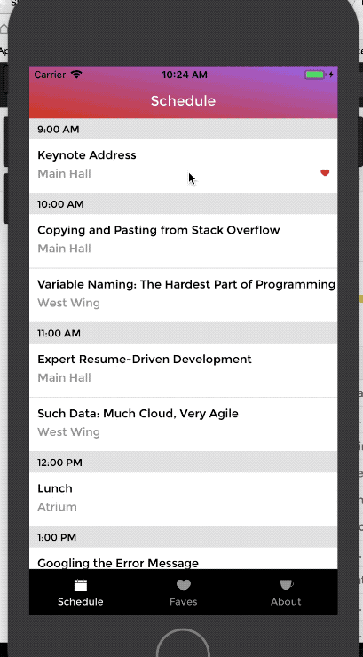

# R10
An example conference schdule app using React Native, both IOS & Android supported.

 
## Installation
1. Download the project, run `> npm install`

2. To run IOS, run `> react-native run-ios`  
To save computing power, run on iPhone SE model using `> react-native run-ios --simulator "iPhone SE"`

3. To run Android, make sure to install Android Studio and follow the config on [React Native Docs](https://facebook.github.io/react-native/docs/getting-started.html#installing-dependencies)  
After the config, start the packager and then run from Android Studio using the Run button.

## Features
* Expo-navigation for navigation stack integration
* Redux for global state management
* Realm as database
* Using react-native-linear-gradient for gradient styling
* Icon animation using LayoutAnimation & Animated RN components

## Some Gotchas
* In ex-nav, data can be passed around as parameters (similar to react navigation)
* Add additional stackNavigation can selectively display tabBar, to satisfy various design needs
* onPress functionality exsits only on certain react native components, like TouchableOpacity, Button, not on View or Text

## Future Directions
* Add map integration

## Author
**Qingxin Yuan**

## Acknowledgement
* Ian Hitchcock for react native animation reference
* RED Academy for project preparation